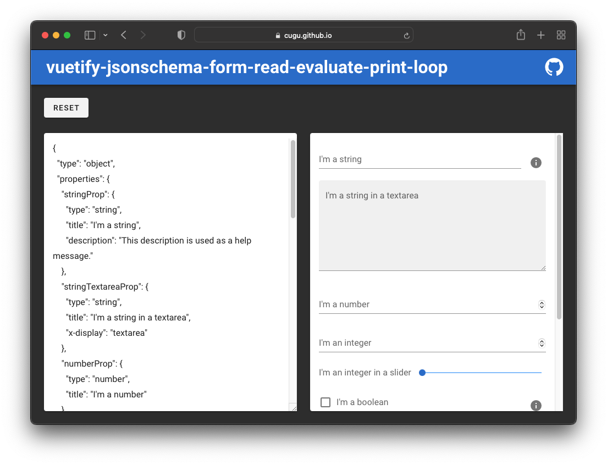

<h1 align="center">vjsfrepl</h1>

[vuetify-jsonschema-form](https://github.com/koumoul-dev/vuetify-jsonschema-form) (vjsf) is a Vue.js component that
allows you to render a jsonschema as an input form using Vue.js and Vuetify.

vjsfrepl is a web page to quickly test the form generation in vjsf.

### :arrow_forward: [Open Page](https://cugu.github.io/vjsfrepl/)

